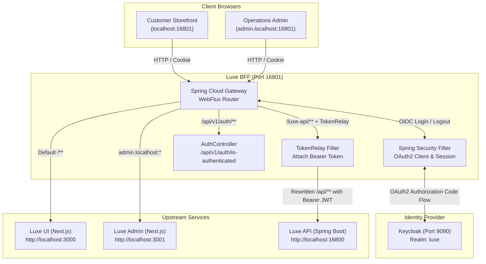

<p align="center">
  
</p>
<h1 align="center">Luxe BFF</h1>
<p align="center">
  <b>A reactive Spring Cloud Gateway and OAuth2 Backend for Frontend (BFF) service providing secure session management, token relay, and unified routing for the Luxe commerce platform.</b>
</p>

Luxe BFF is the browser-facing gateway and security proxy for the Luxe commerce platform. It acts as the single entry point uniting the customer storefront ([Luxe UI](../luxe-ui)), operations dashboard ([Luxe Admin](../luxe-admin)), and core backend ([Luxe API](../luxe-api)).

By implementing the Backend for Frontend (BFF) pattern, the gateway keeps sensitive access and refresh tokens securely on the server. The browser exchanges only an HTTP-only session cookie with the gateway, which automatically attaches and relays the Bearer access token when proxying requests upstream to Luxe API, protecting the application against token leakage and XSS vulnerabilities.

The service is a Java 25, Spring Boot 4 application built on Spring Cloud Gateway (reactive WebFlux) and Spring Security OAuth2 Client, integrated with Keycloak for OpenID Connect authentication.

## Architecture



## Features

### Gateway and route management

- **Single browser entry point** - runs on port `16801`, eliminating CORS issues between frontend applications and backend APIs.
- **Path-based API proxying** - intercepts `/luxe-api/**`, strips the prefix, and transparently routes the request to Luxe API.
- **Host-based admin routing** - routes requests matching `admin.localhost:*` to the Luxe Admin dashboard.
- **Default storefront routing** - fallback route directs all remaining traffic to the Luxe UI customer storefront.
- **Header forwarding** - uses Spring Framework forward-headers strategy to preserve host and protocol across proxies.

### Identity, OAuth2, and session security

- **BFF token security** - stores OAuth2 access and refresh tokens in server-side session memory, never exposing tokens to client-side JavaScript.
- **Keycloak OIDC integration** - manages OAuth2 authentication flows using Keycloak as the centralized identity provider.
- **Multi-client registration**:
  - `keycloak`: Confidential client for Luxe UI customer authentication with client credentials.
  - `keycloak-admin`: Public PKCE client for Luxe Admin operations staff.
- **Automatic token relay** - applies the Spring Cloud Gateway `TokenRelay` filter to inject valid Bearer access tokens into upstream API requests.
- **Route authorization** - enforces strict authentication on `/admin/**` routes while permitting public traffic through storefront routes.
- **Dual logout handlers** - supports dedicated POST `/logout` and POST `/admin/logout` endpoints with distinct post-logout redirects back to the storefront or admin dashboard.

### Authentication contracts and user profile

- **Session verification endpoint** - exposes `GET /api/v1/auth/is-authenticated` for frontends to query authentication status and username.
- **Username resolution** - extracts user identities gracefully from OIDC claims in prioritized order: `preferred_username`, `email`, or principal `name`.
- **Anonymous fallback** - returns a clean `{ "username": "anonymous", "authenticated": false }` payload for unauthenticated requests.

### Operational resilience and observability

- **Reactive non-blocking I/O** - built on Project Reactor and Netty for lightweight, high-throughput request proxying.
- **Actuator health probes** - exposes `/actuator/health` with Kubernetes/Docker liveness and readiness probe support.
- **Graceful shutdown** - drains active HTTP connections cleanly before terminating.
- **Hardened container image** - multi-stage Alpine-based container running as a non-root user with minimal privileges.

## Technology

| Technology | Version | Purpose |
| --- | --- | --- |
| Java | 25 | Application language and runtime |
| Spring Boot | 4.1.0 | Application framework and Actuator |
| Spring Cloud | 2025.1.2 | Cloud release train dependencies |
| Spring Cloud Gateway Server WebFlux | Boot-managed | Reactive routing, path rewriting, and reverse proxying |
| Spring Security OAuth2 Client | Boot-managed | Keycloak OIDC login, session management, and Token Relay |
| Project Reactor / Netty | Boot-managed | Non-blocking reactive runtime engine |
| Gradle | Wrapper | Build and dependency management |
| Docker | Multi-stage | Secure non-root container packaging |

## Local routing

| Browser request | Match rule | Upstream target | Behavior |
| --- | --- | --- | --- |
| `/luxe-api/**` | Any host, Path `/luxe-api/**` | Luxe API (`http://localhost:16800`) | Rewrites path to `/{segment}` and relays Bearer token |
| `admin.localhost:16801/**` | Host `admin.localhost:*` | Luxe Admin (`http://localhost:3001`) | Proxies all admin dashboard traffic |
| `localhost:16801/**` | Fallback Path `/**` | Luxe UI (`http://localhost:3000`) | Proxies customer storefront traffic |
| `/api/v1/auth/is-authenticated` | Local controller | Luxe BFF internal | Returns current user session state |

Next.js frontends rewrite their auth paths to `/bff/**` to interact with the BFF session endpoints:
- Customer login: `http://localhost:16801/oauth2/authorization/keycloak`
- Admin login: `http://admin.localhost:16801/oauth2/authorization/keycloak-admin`
- Session verification: `http://localhost:16801/api/v1/auth/is-authenticated`

## Start localhost

### Prerequisites

- JDK 25
- Luxe API running on [http://localhost:16800](http://localhost:16800)
- Luxe UI running on [http://localhost:3000](http://localhost:3000)
- Luxe Admin running on [http://localhost:3001](http://localhost:3001)
- Keycloak running on [http://localhost:9090](http://localhost:9090) with the `luxe` realm configured

The Gradle wrapper is included, so Gradle does not need to be installed separately.

### 1. Configure the environment

Copy the environment template:

```bash
cp .env.example .env
```

Edit `.env` and fill in the `KEYCLOAK_CLIENT_SECRET` for the `luxe-ui` client obtained from your Keycloak admin console:

```dotenv
BFF_PORT=16801
LUXE_API_URL=http://localhost:16800
LUXE_UI_URL=http://localhost:3000
LUXE_ADMIN_URL=http://localhost:3001
LUXE_ADMIN_HOST_PATTERN=admin.localhost:*
LUXE_UI_PUBLIC_URL=http://localhost:16801/
LUXE_ADMIN_PUBLIC_URL=http://admin.localhost:16801/
KEYCLOAK_ISSUER_URI=http://localhost:9090/realms/luxe
KEYCLOAK_CLIENT_ID=luxe-ui
KEYCLOAK_CLIENT_SECRET=<your-keycloak-client-secret>
KEYCLOAK_ADMIN_CLIENT_ID=luxe-admin
OAUTH2_REDIRECT_URI=http://localhost:16801/bff/login/oauth2/code/keycloak
OAUTH2_ADMIN_REDIRECT_URI=http://admin.localhost:16801/bff/login/oauth2/code/keycloak-admin
```

### 2. Configure Keycloak client redirect URIs

Ensure your Keycloak clients in the `luxe` realm allow the following Valid Redirect URIs and Post-Logout Redirect URIs:

**Client `luxe-ui`:**
- Valid redirect URIs: `http://localhost:16801/bff/login/oauth2/code/keycloak`
- Valid post-logout redirect URIs: `http://localhost:16801/*`
- Web origins: `http://localhost:16801`

**Client `luxe-admin`:**
- Valid redirect URIs: `http://admin.localhost:16801/bff/login/oauth2/code/keycloak-admin`
- Valid post-logout redirect URIs: `http://admin.localhost:16801/*`
- Web origins: `http://admin.localhost:16801`

### 3. Start the gateway

Export the environment variables and run the application with the Gradle wrapper:

```bash
set -a
source .env
set +a
./gradlew bootRun
```

When startup completes, the gateway is ready:

- **Customer storefront**: [http://localhost:16801](http://localhost:16801)
- **Admin dashboard**: [http://admin.localhost:16801](http://admin.localhost:16801)
- **Auth check**: [http://localhost:16801/api/v1/auth/is-authenticated](http://localhost:16801/api/v1/auth/is-authenticated)
- **Health check**: [http://localhost:16801/actuator/health](http://localhost:16801/actuator/health)

## Environment variables

| Variable | Default | Purpose |
| --- | --- | --- |
| `BFF_PORT` | `16801` | Port on which the BFF gateway listens |
| `LUXE_API_URL` | `http://localhost:16800` | Upstream URL for Luxe API |
| `LUXE_UI_URL` | `http://localhost:3000` | Upstream URL for Luxe UI storefront |
| `LUXE_ADMIN_URL` | `http://localhost:3001` | Upstream URL for Luxe Admin dashboard |
| `LUXE_ADMIN_HOST_PATTERN` | `admin.localhost:*` | Host matching pattern for routing to Luxe Admin |
| `LUXE_UI_PUBLIC_URL` | `http://localhost:16801/` | Public base URL and post-logout destination for UI |
| `LUXE_ADMIN_PUBLIC_URL` | `http://admin.localhost:16801/` | Public base URL and post-logout destination for Admin |
| `KEYCLOAK_ISSUER_URI` | `http://localhost:9090/realms/luxe` | Keycloak OpenID Connect realm issuer endpoint |
| `KEYCLOAK_CLIENT_ID` | `luxe-ui` | Customer client registration ID in Keycloak |
| `KEYCLOAK_CLIENT_SECRET` | *(Required)* | Customer client secret for confidential authentication |
| `KEYCLOAK_ADMIN_CLIENT_ID` | `luxe-admin` | Admin dashboard public PKCE client ID |
| `OAUTH2_REDIRECT_URI` | `http://localhost:16801/bff/login/oauth2/code/keycloak` | OAuth2 callback redirect URI for storefront users |
| `OAUTH2_ADMIN_REDIRECT_URI` | `http://admin.localhost:16801/bff/login/oauth2/code/keycloak-admin` | OAuth2 callback redirect URI for admin users |

## Useful commands

| Command | Purpose |
| --- | --- |
| `./gradlew bootRun` | Start the local BFF development server |
| `./gradlew test` | Run the unit and context tests |
| `./gradlew clean build` | Build the project and package the executable JAR |
| `docker build -t luxe-bff:local .` | Build the multi-stage production Docker container |

## Project structure

```text
luxe-bff/
├── assets/
│   └── LUXE-no-bg.png                     # Luxe branding logo
├── deploy/
│   ├── README.md                          # Production deployment guidelines
│   └── compose.production.yaml            # Production Docker Compose definition
├── src/
│   ├── main/
│   │   ├── java/kh/edu/istad/luxe/bff/
│   │   │   ├── config/
│   │   │   │   └── SecurityConfig.java    # OAuth2 login, logout handlers, and route security
│   │   │   ├── controller/
│   │   │   │   └── AuthController.java    # /api/v1/auth/is-authenticated endpoint
│   │   │   ├── dto/
│   │   │   │   └── AuthenticatedUser.java # Authenticated session response DTO
│   │   │   └── BffApplication.java        # Spring Boot application entry point
│   │   └── resources/
│   │       └── application.yaml           # Gateway routing, OAuth2 client, and Actuator config
│   └── test/
│       └── java/kh/edu/istad/luxe/bff/
│           └── BffApplicationTests.java   # Spring Boot context loading test
├── Dockerfile                             # Multi-stage non-root container definition
├── build.gradle                           # Dependencies and Gradle build configuration
├── settings.gradle                        # Gradle project settings
└── .env.example                           # Template for local environment variables
```

## Production deployment

In production, the BFF runs in a Docker container alongside Luxe API, Redis, Keycloak, MinIO, and Caddy on the shared `luxe-net` Docker network.

### 1. Reverse proxy (Caddy)

Caddy terminates SSL for the BFF domain and proxies to `luxe-bff:16801`:

```caddy
bff.luxe-kh.online {
    encode zstd gzip
    reverse_proxy luxe-bff:16801
}
```

### 2. Frontend configuration

The storefront ([Luxe UI](../luxe-ui)) and dashboard ([Luxe Admin](../luxe-admin)) deployed on Vercel proxy their API and authentication requests through the BFF:

```dotenv
LUXE_BFF_URL=https://bff.luxe-kh.online
```

### 3. Keycloak production redirect URIs

Ensure the Keycloak production realm allows these callback and logout URIs:

```text
https://www.luxe-kh.online/bff/login/oauth2/code/keycloak
https://admin.luxe-kh.online/bff/login/oauth2/code/keycloak-admin
```

Valid post-logout redirect URIs:
```text
https://www.luxe-kh.online/*
https://admin.luxe-kh.online/*
```

### 4. Verification smoke tests

Verify that the production gateway and upstream routing are operational:

```bash
# Check BFF gateway health
curl --fail https://bff.luxe-kh.online/actuator/health

# Check API health through BFF proxy
curl --fail https://bff.luxe-kh.online/luxe-api/actuator/health

# Check public API endpoints through storefront and admin domains
curl --fail https://www.luxe-kh.online/luxe-api/api/v1/products
curl --fail https://admin.luxe-kh.online/luxe-api/api/v1/products
```
